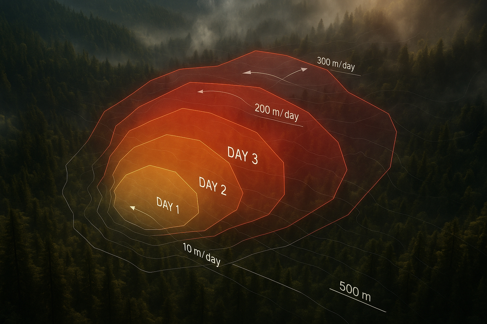
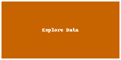

# Management Practices Prevent Compound Disturbance

<a href="https://github.com/CU-ESIIL/management-practices-prevent-thresholds-innovation-summit-2025__17/edit/main/docs/index.md" title="Edit this page">✏️</a>

<!-- =========================================================
HERO (Swap hero.jpg, title, strapline, and the three links)
========================================================= -->

[Raw photo location: hero.jpg](https://github.com/CU-ESIIL/management-practices-prevent-thresholds-innovation-summit-2025__17/blob/main/docs/assets/hero.jpg)

**One sentence on impact:** We are going to use an LLM to identify the management actions that primarily take place following disturbances that facilitate fire, such as wind, drought, insect/path, and fire.

**[Sprint brief](assets/Seven%20ways%20to%20measure%20fire%20polygon%20velocity-4.pdf) · [View shared code](https://github.com/CU-ESIIL/management-practices-prevent-thresholds-innovation-summit-2025__17/blob/main/code/single_hull_demo.py) · [Explore data](https://github.com/CU-ESIIL/management-practices-prevent-thresholds-innovation-summit-2025__17/blob/main/code/prism_quicklook.py)**

> **About this site:** This public log captures our rapid work at the Innovation Summit. Update it directly in your browser (open a file → pencil icon → Commit changes) so teammates and partners can follow along.

---

## How to use this page (for the team)
- **Edit this file:** `docs/index.md` → ✎ → change text → **Commit changes**.
- **Add images:** upload to `docs/assets/` and reference like `assets/your_file.png`.
- Keep **text short** and **visuals first**. Think “slide captions,” not essays.

---

## Day 1 — Define & Explore
*Focus: Exploring management actions around linked disturbances

### Our product 📣
- A synthesis manuscript and high level dataset of forest management actions (maybe a map or something)

### Our question(s) 📣
- What management actions take place after drought, windstorm, fire, and insect/path to prevent future wildfires?
-Ie. how are managers purposefully or inadvertently breaking disturbance links in order to prevent future catastrophic disturbances and tipping points?

### Hypotheses / intentions 📣
-We expect to have a ton of fun and learn a lot :_

### Why this matters (the “upshot”) 📣
Keeping working lands intact depends on catching tipping points early. Reliable, transparent indicators help conservation districts invest in the right practices before recovery becomes costly or impossible.

### Inspirations (papers, datasets, tools)
- Publication: [Detecting ecological thresholds in dryland ecosystems](https://doi.org/10.1111/gcb.16512)
- Dataset portal: [USGS Landsat Collection 2 surface reflectance](https://www.usgs.gov/landsat-missions/landsat-collection-2)
- Tool/tech: [PyBreakpoints — Bayesian change point detection](https://github.com/alan-turing-institute/pybreakpoints)

### Field notes / visuals

[Raw photo location: day1_whiteboard.jpg](https://github.com/CU-ESIIL/management-practices-prevent-thresholds-innovation-summit-2025__17/blob/main/docs/assets/day1_whiteboard.jpg)
*Caption: Scoping session mapping management levers (grazing, irrigation, restoration) to measurable early warning signals.*

> **Different perspectives:** Ranching partners emphasized socio-economic thresholds (labor, funding) alongside ecological ones; we parked those for future integration.

---

## Day 2 — Data & Methods
*Focus: what we’re testing and building; show a first visual (plot/map/screenshot/GIF).*

### Data sources we’re exploring 📣
<!-- EDIT: Link each source; add size/notes if relevant. -->
- **Source A**
- **Soil moisture anomalies** from [GridMET](https://www.climatologylab.org/gridmet.html) regridded to allotment boundaries.

  
[Raw photo location: explore_data_plot.png](https://github.com/CU-ESIIL/management-practices-prevent-thresholds-innovation-summit-2025__17/blob/main/docs/assets/explore_data_plot.png)
  *Snapshot: Standardized anomaly series highlights persistent drying in 2022–2023.*

- **Practice implementation log** compiled by Western Water Conservancy (rotational grazing, riparian buffers, rest periods).
- **Vegetation vigor** (NDVI) from Landsat 8/9 30 m composites created with Google Earth Engine.
  *Snapshot showing initial data patterns.*

- Source B — link and 1-line description

### Methods / technologies we’re testing 📣
- Approach 1 (e.g., time-series break detection)
- Approach 2 (e.g., random forest on features)
- Visualization (e.g., map tiles, small multiples)

### Challenges identified
- Data gaps / quality issues
- Method limitations / compute constraints
- Open questions we need to decide on

### Visuals
#### Static figure

[Raw photo location: figure1.png](https://github.com/CU-ESIIL/management-practices-prevent-thresholds-innovation-summit-2025__17/blob/main/docs/assets/figure1.png)
*Figure 1.* One line on what this suggests.

#### Animated change (GIF)

[Raw photo location: change.gif](https://github.com/CU-ESIIL/management-practices-prevent-thresholds-innovation-summit-2025__17/blob/main/docs/assets/change.gif)
*Figure 2.* One line on what changes across time.

#### Interactive map (iframe)
<iframe
  title="Study area (OpenStreetMap)"
  src="https://www.openstreetmap.org/export/embed.html?bbox=-105.35%2C39.90%2C-105.10%2C40.10&layer=mapnik&marker=40.000%2C-105.225"
  width="100%" height="360" frameborder="0"></iframe>

<a href="https://www.openstreetmap.org/?mlat=40.000&mlon=-105.225#map=12/40.0000/-105.2250">Open full map</a>

> If an embed doesn’t load, put the normal link directly under it.

---

## Final Share Out — Insights & Sharing
*Focus: synthesis; highlight 2–3 visuals that tell the story; keep text crisp. Practice a 2-minute walkthrough of the homepage 📣: Why → Questions → Data/Methods → Findings → Next.*

[Raw photo location: team_photo.jpg](https://github.com/CU-ESIIL/management-practices-prevent-thresholds-innovation-summit-2025__17/blob/main/docs/assets/team_photo.jpg)

### Findings at a glance 📣
<!-- EDIT: 2–4 bullets, each a headline in plain language with a number if possible. -->
- Headline 1 — what, where, how much
- Headline 2 — change/trend/contrast
- Headline 3 — implication for practice or policy

### Visuals that tell the story 📣
<!-- EDIT: Swap visuals; prioritize clarity. -->

[Raw photo location: fire_hull.png](https://github.com/CU-ESIIL/management-practices-prevent-thresholds-innovation-summit-2025__17/blob/main/docs/assets/fire_hull.png)
*Visual 1.* Swap in the primary graphic that clearly communicates your core takeaway.

[Raw photo location: hull_panels.png](https://github.com/CU-ESIIL/management-practices-prevent-thresholds-innovation-summit-2025__17/blob/main/docs/assets/hull_panels.png)
*Visual 2.* Use a complementary panel, collage, or set of snapshots that reinforces supporting evidence.

[Raw photo location: main_result.png](https://github.com/CU-ESIIL/management-practices-prevent-thresholds-innovation-summit-2025__17/blob/main/docs/assets/main_result.png)
*Visual 3.* Highlight an additional visual that captures a secondary insight or next step.

<iframe
  title="Short explainer video (optional)"
  width="100%" height="360"
  src="https://www.youtube.com/embed/ASTGFZ0d6Ps"
  frameborder="0" allow="accelerometer; autoplay; clipboard-write; encrypted-media; gyroscope; picture-in-picture; web-share"
  allowfullscreen></iframe>

### What’s next? 📣
- Immediate follow-ups
- What we would do with one more week/month
- Who should see this next

---

## Featured links (image buttons)
<table>
<tr>
<td align="center" width="33%">
  <a href="assets/Seven%20ways%20to%20measure%20fire%20polygon%20velocity-4.pdf"> <strong>Read the brief</strong></a>
</td>
<td align="center" width="33%">
  <a href="https://github.com/CU-ESIIL/management-practices-prevent-thresholds-innovation-summit-2025__17/blob/main/code/single_hull_demo.py"> <strong>View code</strong></a>
</td>
<td align="center" width="33%">
  <a href="https://github.com/CU-ESIIL/management-practices-prevent-thresholds-innovation-summit-2025__17/blob/main/code/prism_quicklook.py"> <strong>Explore data</strong></a>
</td>
</tr>
</table>

---

## Team
| Name | Role | Contact | GitHub |
|------|------|---------|--------|
| Sofia Martinez | Lead scientist | sofia.martinez@colorado.edu | @sofiamartinez |
| Marcus Li | Data scientist | marcus.li@colostate.edu | @mlisystems |
| Talia Yazzie | Community partner liaison | talia.yazzie@ntuniv.edu | @taliy |
| Arjun Patel | Decision support engineer | arjun.patel@wwc.org | @apatel |

---

## Storage

Code
Keep shared scripts, notebooks, and utilities in the [`code/`](https://github.com/CU-ESIIL/management-practices-prevent-thresholds-innovation-summit-2025__17/tree/main/code) directory. Document how to run them in a README or within the files so teammates and visitors can reproduce your workflow.

Documentation
Use the [`docs/`](https://github.com/CU-ESIIL/management-practices-prevent-thresholds-innovation-summit-2025__17/tree/main/docs) folder to publish project updates on this site. Longer internal notes can live in [`documentation/`](https://github.com/CU-ESIIL/management-practices-prevent-thresholds-innovation-summit-2025__17/tree/main/documentation); summarize key takeaways here so the public story stays current.

---

## Cite & reuse
If you use these materials, please cite:

> Martinez, S., Li, M., Yazzie, T., Patel, A. (2025). *Management Practices Prevent Thresholds — Innovation Summit 2025 (Group 17).* https://github.com/CU-ESIIL/management-practices-prevent-thresholds-innovation-summit-2025__17

License: CC-BY-4.0 unless noted. See dataset licenses on the **[Data](data.md)** page.

---

<!-- EDIT HINTS
- Upload images to docs/assets/ and reference as assets/filename.png
- Keep images ~1200 px wide; avoid >5–8 MB per file.
- Use short, active sentences; this is a scrolling “slide deck.”
- Update this page at least once per day during the sprint.
-->
